# Spoke-to-Spoke: Remote Peering with Transit Routing

Remote VCN peering is the process of connecting two VCNs in different regions (but the same tenancy). The peering allows the VCNs' resources to communicate using private IP addresses without routing the traffic over the internet or through your on-premises network.

Imagine that in each region you have multiple VCNs in a hub-and-spoke layout, as shown in the following diagram. The spoke VCNs in a given region are locally peered with the hub VCN in the same region, using local peering gateways.

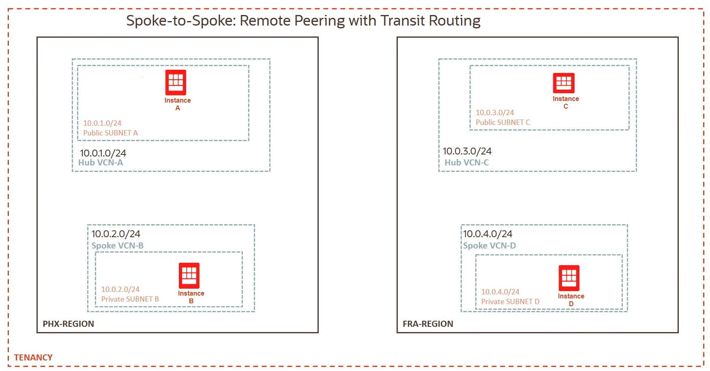

1. Log in to the OCI console, go to the Frankfurt region and create two separate VCNs with the following name and CIDR.

    ```shell
    Name: VCN-A-Hub
    CIDR: 10.0.1.0/24
    ```

    ```shell
    Name: VCN-B-Spoke
    CIDR: 10.0.2.0/24
    ```

    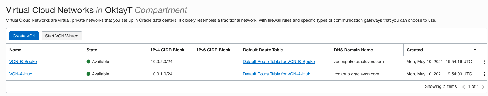

2. Create a subnet for VCN-A-Hub with the following attributes.

    ```shell
    Name: Subnet-A
    Subnet Type: Regional
    CIDR: 10.0.1.0/24 (full subnet)
    Route Table: Default Route Table
    Subnet Access: Public Subnet (Since this is a Hub, Subnet should be Public)
    DHCP Options: Default DHCP
    Security List: Default Security List
    ```

    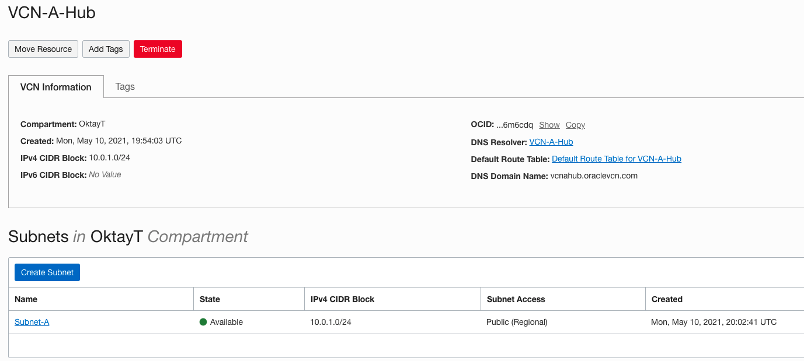

3. Create an Internet Gateway for VCN-A-Hub named **IG-A**

4. Add Route Rule to the Default Route Table for VCN-A-Hub with the following attributes.

    ```shell
    Target Type: Internet Gateway
    Destination CIDR Block: 0.0.0.0/0
    Target Internet Gateway in OKT_TEST: IG-A
    ```

    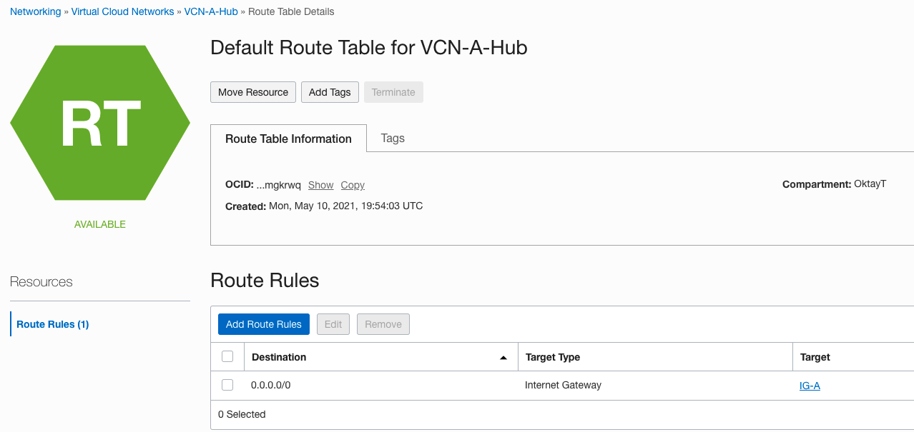

5. Create a subnet for the VCN-B-Spoke with the following attributes.

    ```shell
    Name: Subnet-B
    CIDR: 10.0.2.0/24 (full subnet)
    Subnet Type: Private (Since this is Spoke, subnet should be Private)
    Route Table: Default Route Table
    Subnet Access: Public Subnet (Since this is a Hub, Subnet should be Public)
    DHCP Options: Default DHCP
    Security List: Default Security List
    ```
    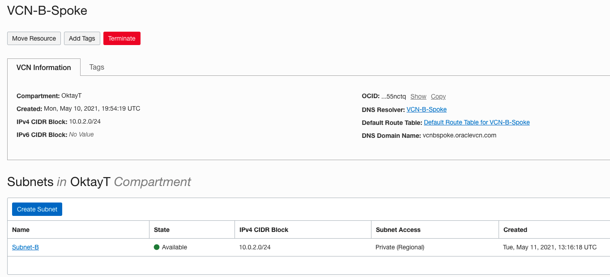

6. Add an Ingress Rule to the Default Security List for VCN-B-Spoke. With this rule, we are going to allow all traffic from VCN-A-Hub.

    ```shell
    Source Type: CIDR
    Source CIDR: 10.0.1.0/24
    IP Protocol: All Protocols
    ```

    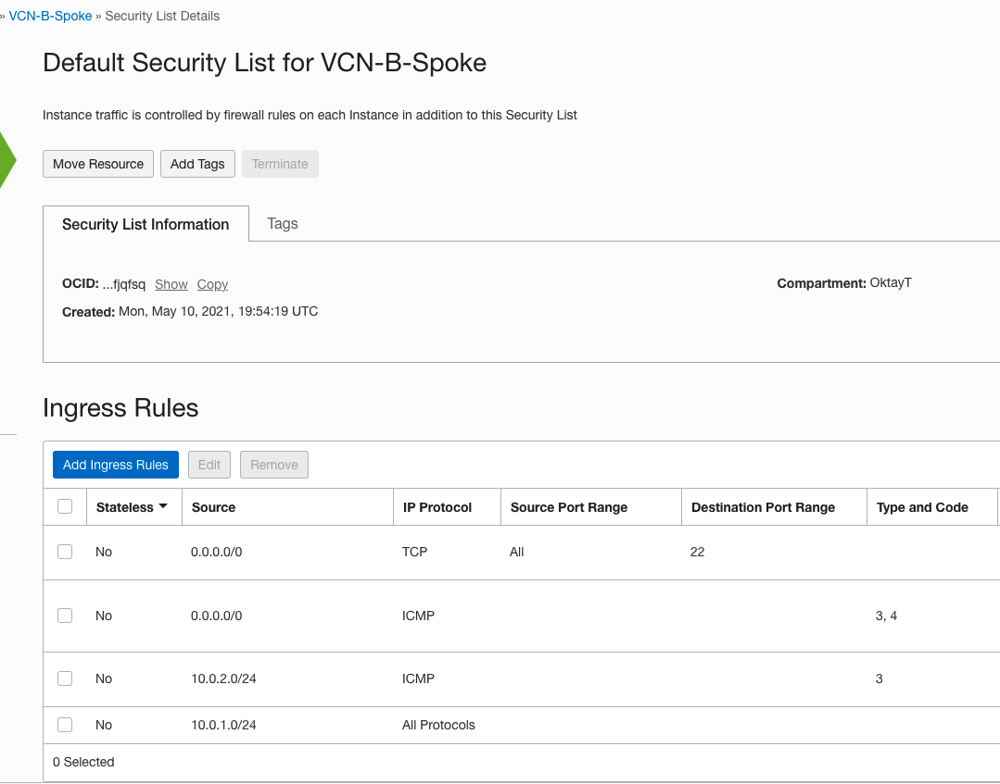

7. Create a Local Peering Gateway for VCN-B-Spoke named **LPG-BtoA**

8. Add a route rule to the Default Route Table for VCN-B-Spoke. With this rule, all the traffic 10.0.1.0/24 which is are subnet-A is going to be pass through the LPG-BtoA

    ```shell
    Target Type: Local Peering Gateway
    Destination CIDR Block: 10.0.1.0/24
    Target Internet Gateway in OKT_TEST: LPG-BtoA
    ```

    

9. Add an Ingress Rule to the Default Security List for VCN-A-Hub. With this rule, we are going to allow all traffic from VCN-B-Spoke

    ```shell
    Source Type: CIDR
    Source CIDR: 10.0.2.0/24
    IP Protocol: All Protocols
    ```

    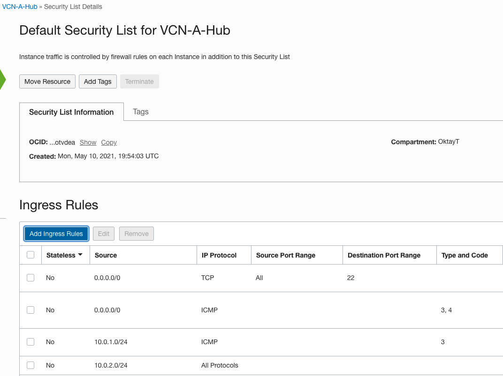

10. Create a Local Peering Gateway for VCN-A-Hub named **LPG-AtoB**

11. Add a route rule to the Default Route Table for VCN-A-Hub. All the traffic 10.0.2.0/24 which is are subnet-B is going to be pass through the LPG-AtoB

    ```shell
    Target Type: Local Peering Gateway
    Destination CIDR Block: 10.0.2.0/24
    Target Internet Gateway in OKT_TEST: LPG-AtoB
    ```

    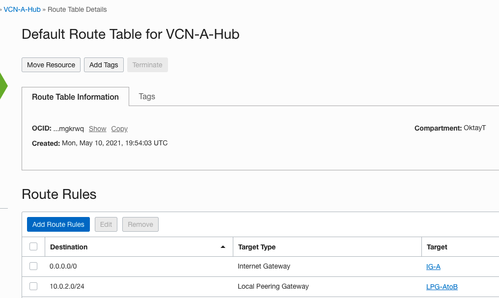

12. Go to "Local Peering Gateways" tab in the "Networking/Virtual Cloud Networks/Virtual Cloud Network Details" path in VNC-A-HUB and click the "Establish Peering Connection" option to provide peer to peer connection.

    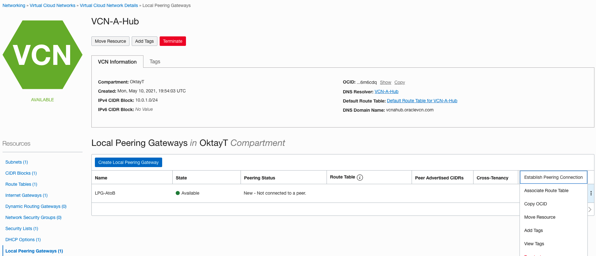

    ```shell
    Virtual Cloud Network: VCN-B-Spoke
    Unpeered Peer Gateway: LPG-BtoA
    ```

    > A few minutes after execution, "Peering Status" should be "Peered - Connected to a peer" as below.

    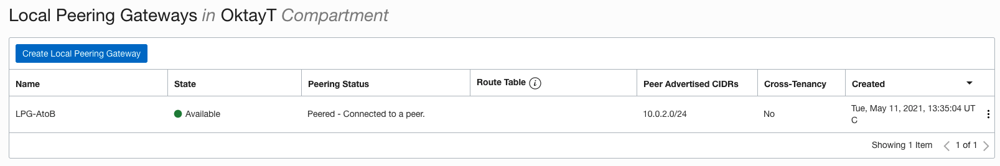

13. Create an instance in VNC-A-Hub with the following attributes.

    ```shell
    Name: instance-A
    VCN: VCN-A-Hub
    Subnet: Subnet-A (Regional) 
    Public IP Address: Assign a public IPv4 address
    Add SSH keys: Save Private key as name "ssh-key-instance-A.key"
    ```

14. When the instance status is "running", copy Public IP addresses from the Instances page and test the connection with the ssh key saved in Step-13. 

    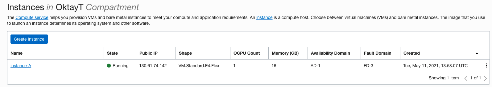

    > `Open an ssh connection and paste the commands below.`

    ```shell
    chmod 400 /Users/oktaytuncay/Desktop/Cloud/OCI_Keys/ssh-key-instance-A.key

    ssh -i /Users/oktaytuncay/Desktop/Cloud/OCI_Keys/ssh-key-instance-A.key opc@130.61.74.142
    ```

15. After establishing the connecting to the instance-A, create ssh-keygen on instance-A with the following commands. 

    * *ssh-keygen will ask for a few questions, these steps can be skipped by pressing enter.*

    ```shell
    [opc@instance-a ~]$ cd .ssh
    [opc@instance-a .ssh]$ ssh-keygen
    Generating public/private rsa key pair.
    Enter file in which to save the key (/home/opc/.ssh/id_rsa): 
    Enter passphrase (empty for no passphrase): 
    Enter same passphrase again: 
    Your identification has been saved in /home/opc/.ssh/id_rsa.
    Your public key has been saved in /home/opc/.ssh/id_rsa.pub.
    The key fingerprint is:
    SHA256:g3/BsITorjxz7CTtE82zMUTBjlUC+kkt+/YSr590ZhE opc@instance-a
    The key's randomart image is:
    +---[RSA 2048]----+
    |    .ooo.        |
    |   . o+o         |
    |  . +=o o E      |
    |   +.+oo + .     |
    |    =+. S +      |
    |   o..B. . o     |
    |  ..+.oBo =      |
    | .o=+.oo.*       |
    |  o=o..++        |
    +----[SHA256]-----+
    [opc@instance-a .ssh]$ cat id_rsa.pub 
    ssh-rsa 
    ```

    **Note:** Copy the output of cat command (we will use this in the next step.)

    **Example:**
    ```shell
    [opc@instance-a .ssh]$ cat id_rsa.pub 
    ssh-rsa AAAAB3NzaC1yc2EAAAADAQABAAABAQDFi3igDPDoPYCWBnpUt9JgrCcGGbWNypL8pRoLwUAOypIVgyl8wiBNbgv5L2IgYmBsGHyCoPpCqUarjZbIoHKzYYC0bIwyjoIR9WEHRjf6IWfw9OPJ3tj9xBaZ4J044dDu1xRxbJlb8xd3EsWn3s1gJC9NSHcPBSnL3VhBPjhNRi8Nz+iHFReubRuo3wIT80huu2fPyvxyRh+CIzTpYU1C0keMKU0/    0qcUzvc0iUXSlyfyqck5h4w8GnlBVcr2pgmdfNKlncQngKyVpab7wfB8H4HD4peQJgyHNLLFH33FGlwQRrEUV5yHEbUAu1MiidprfEuYpWNNr69UAN5mWFO5    opc@instance-a
    ```

16. Create an instance in the VNC-B-Spoke with the following attributes.

    ```shell
    Name: instance-B
    VCN: VCN-B-Spoke
    Subnet: Subnet-B (Regional)
    Public IP Address: Do not assign a public IPv4 address
    Add SSH keys: Paste public keys; Paste the output we fetch previous step
    ```

    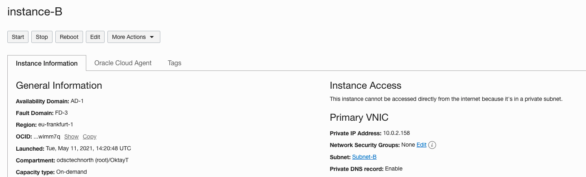

17. Copy instance-B Private IP Address and test passwordless connection from instance-A and instance-B

    ```shell
    [opc@instance-a .ssh]$ ssh 10.0.2.158 hostname
    instance-b
    ```

    > `The connection has been established.`

18. Log in to the OCI console, go to the Phoenix region and repeat the first 17 steps in the Phoenix region with the following attributes.

    |Frankfurt|Phoenix|
    |---------|-------|
    |VCN-A-Hub| VCN-C-Hub|
    | 10.0.1.0/24|10.0.3.0/24|
    |VCN-B-Spoke|VCN-D-Spoke|
    |10.0.2.0/24|10.0.4.0/24|
    |Subnet-A|Subnet-C|
    |IG-A|IG-C|
    |Subnet-B|Subnet-D|
    |LPG-BtoA|LPG-DtoC|
    |LPG-AtoB|LPG-CtoD|
    |instance-A|instance-C|
    |instance-B|instance-D|
    |ssh-key-instance-A.key|ssh-key-instance-C.key|

### Establishing a remote peering connection between VCN-A-Hub and VCN-C-Hub.

19. Go to "Networking/Customer Connectivity/Dynamic Routing Gateway" path and create Dynamic Routing Gateway in Frankfurt region named **DRG-A**.

20. Go to "Networking/Virtual Cloud Networks/Virtual Cloud Network Details/Dynamic Routing Gateways" path and "Attach Dynamic Routing Gateway" for VNC-A-HUB

    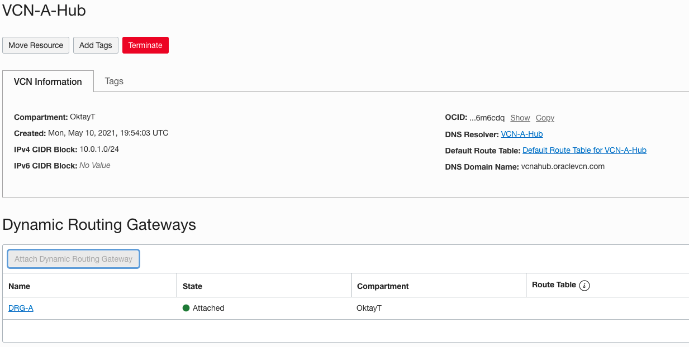

21. Add a route rule to the Default Route Table for VCN-A-Hub. 

    ```shell
    Target Type: Dynamic Routing Gateways
    Destination CIDR Block: 10.0.3.0/24
    ```

22. Add an Ingress Rule to the Default Security List for VCN-A-Hub. 

    ```shell
    Source Type: CIDR
    Source CIDR: 10.0.3.0/24
    IP Protocol: All Protocols
    ```

With this step, we created a DRG, add a rule in the route table, and allow traffic with the added row in the security list.

23. Go to "Networking/Customer Connectivity/Dynamic Routing Gateways/DRG-A/Remote Peering Connections" path and create remote peering connection named RPC-AtoC.

* Copy Remote Peering Connection OCID from RPC-AtoC vertical ellipsis menu.

    **Example:**
	* ocid1.remotepeeringconnection.oc1.eu-frankfurt-1.aaaaaaaau7okrl5kogn5r4dpwaxpkemxtrv6lnbhjj73udp2wx44lezgtc6a

    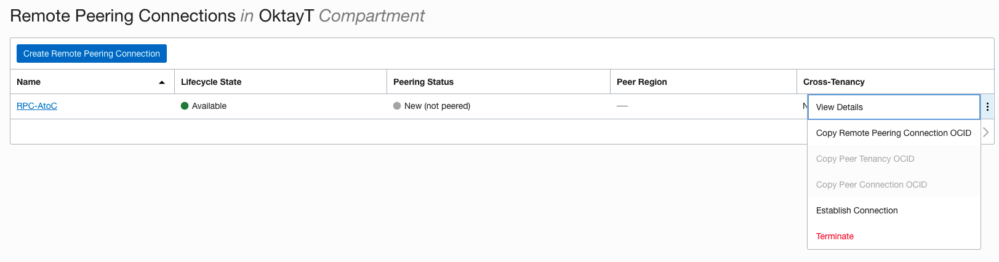

24. Go to "Networking/Customer Connectivity/Dynamic Routing Gateway" path and create a Dynamic Routing Gateway in Phoenix region named **DRG-C**.

25. Go to "Networking/Virtual Cloud Networks/Virtual Cloud Network Details/Dynamic Routing Gateways" path and "Attach Dynamic Routing Gateway" for VNC-C-HUB

    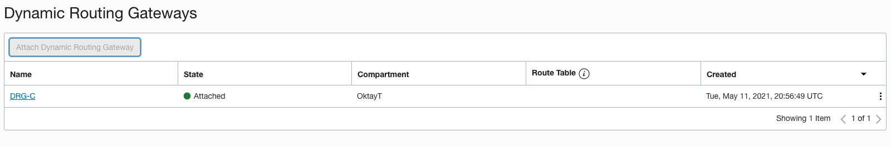

26. Add a route rule to the Default Route Table for VCN-C-Hub. 

    ```shell
    Target Type: Dynamic Routing Gateways
    Destination CIDR Block: 10.0.1.0/24
    ```

27. Add an Ingress Rule to the Default Security List for VCN-C-Hub. 

    ```shell
    Source Type: CIDR
    Source CIDR: 10.0.1.0/24
    IP Protocol: All Protocols
    ```

28. Go to the "Networking/Customer Connectivity/Dynamic Routing Gateways/DRG-C/Remote Peering Connections" path and create remote peering connection named RPC-CtoA

    * From RPC-CtoA vertical ellipsis menu, click "Establish Connection" and set the required variables as follows.

    ```shell
	Region: eu-frankfurt-1
	Remote Peering Connection OCID: paste Remote Peering Connection OCID from step 23.
    ```

29. Copy the instance-c private IP address from instance page and test connection between instance-a and instance-c by ping command

    ```shell
    [opc@instance-a ~]$ ping 10.0.3.140
    PING 10.0.3.140 (10.0.3.140) 56(84) bytes of data.
    64 bytes from 10.0.3.140: icmp_seq=1 ttl=62 time=161 ms
    64 bytes from 10.0.3.140: icmp_seq=2 ttl=62 time=161 ms
    64 bytes from 10.0.3.140: icmp_seq=3 ttl=62 time=161 ms
    ```

    * We are able to achieve connetivity between VCN-A and VCN-C (between Phoenix and Frankfurt regions)

 * As the next step, we are going to enable connetivity between the Spoke regions. If we try to ping from instance-b (VCN-B-Spoke Frankfurt) to instance-d (VCN-D-Spoke Phoenix), we wont be able to do that because we are not created a assosiated route table, DRG and Local Peering Gateway.

30. Go to "Networking/Virtual Cloud Networks/Virtual Cloud Network Details/Route Tables" path for VCN-A-Hub and create two additional route tables to the respective Gateway which are DRG and LPG as follows.

    ```shell
    Name: RT-DRG
	Name: RT-LPG
    ```

31. We are going to add some rules to both.

    * For RT-DRG:
    ```shell
	Target Type: Local Peering Gateway
	Destination CIDR Block: 10.0.2.0/24
	Target Local Peering Gateway in OktayT: LPG-AtoB
	```

    * For RT-LPG: Since this one is in VCN-A, the destination should be both VCN-C and VCN-D, so we are going to add two rules here.

    ```shell
	Target Type: Dynamic Routing Gateway
	Destination CIDR Block: 10.0.3.0/24
    + Another Route Rule
    Target Type: Dynamic Routing Gateway
	Destination CIDR Block: 10.0.4.0/24
	```

	* So there should be two rules for RT-LPG and one rule for RT-DRG.

    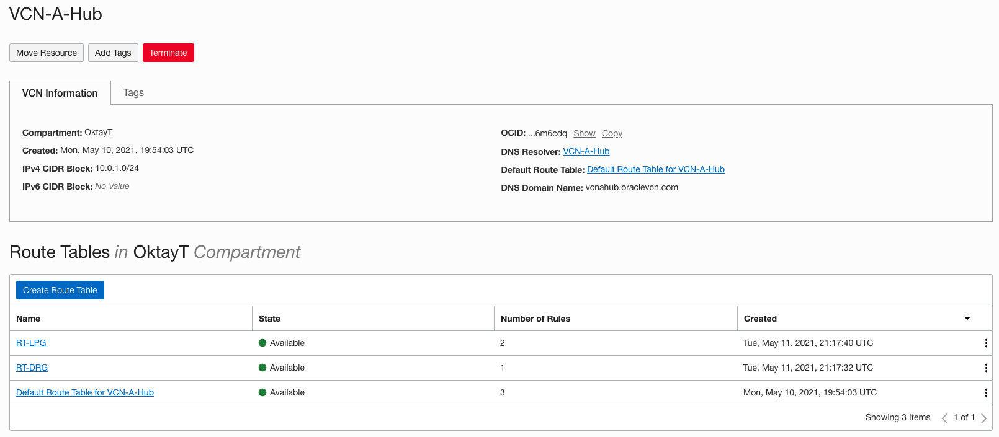

32. Add Route Rule to the Default Route Table for VCN-A-Hub for Spoke with the following attributes.

    ```shell
	Target Type: Dynamic Routing Gateway
	Destination CIDR Block: 10.0.4.0/24
	```

    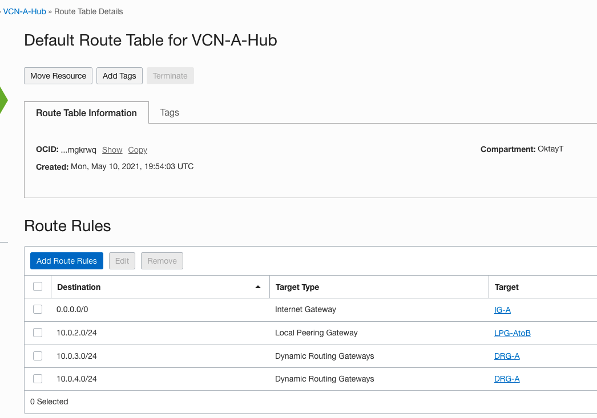

33. Assosiate the route tables:

    * Go to "Networking/Virtual Cloud Networks/Virtual Cloud Network Details/Dynamic Routing Gateways" path for VCN-A-Hub and associate the route table as **RT-DRG** from DRG-A vertical ellipsis menu.

    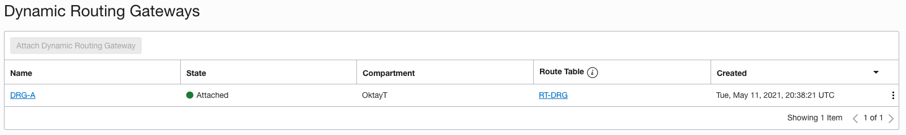

    * Go to "Networking/Virtual Cloud Networks/Virtual Cloud Network Details/Local Peering Gateways" path for VCN-A-Hub and associate the route table as **RT-LPG** from DRG-A vertical ellipsis menu.

    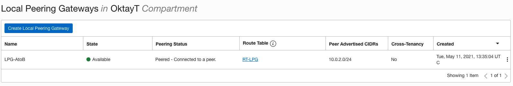

34. Add an Ingress Rule to the Default Security List for VCN-A-Hub. 

    ```shell
    Source Type: CIDR
    Source CIDR: 10.0.4.0/24
    IP Protocol: All Protocols
    ```
    * With this step, we are all set for VCN-A-Hub

    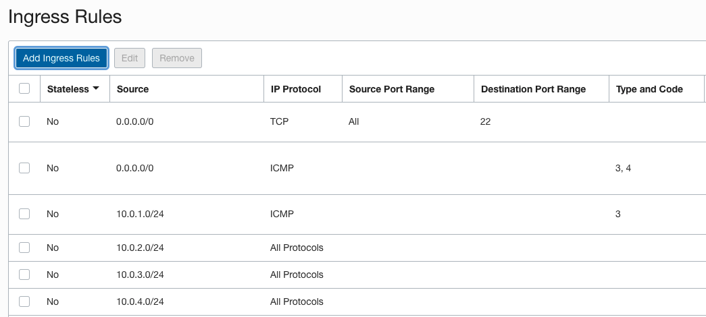

35. Go to "Networking/Virtual Cloud Networks/VCN-B-Spoke/Route Table Details" and edit the listed rule to be "Destination CIDR Block: 0.0.0.0/0".

	* All the traffic that is coming out from subnet-B(VNC-B) is going through the Local Peering Gateway. We could have added two more rules without editing, but to keep it simple, we went this way without adding more rules.


36. Go to "Networking/Virtual Cloud Networks/VCN-B-Spoke/Security List Details" path and add two Ingress Rules to Default Security List of VCN-B-Spoke for instance-c and instance-d.

    ```shell
	Source Type: CIDR
	Source CIDR: 10.0.3.0/24 
	IP Protocol: All Protocols

	Source Type: CIDR
	Source CIDR: 10.0.4.0/24 
	IP Protocol: All Protocols
    ```

	* With this step, we are all set for VCN-B-Spoke

* We should do something similar for the Phoenix region.

37. Go to the "Networking/Virtual Cloud Networks/Virtual Cloud Network Details/Route Tables" for VCN-C-Hub in the Phoenix region and create two additional routing tables named RT-DRG and RT-LPG.

    * For both of these, we are going to add some rules.

    ```shell
    For RT-DRG:
    Target Type: Local Peering Gateway
	Destination CIDR Block: 10.0.4.0/24
	Target Local Peering Gateway in OktayT: LPG-CtoD
    ```
    
    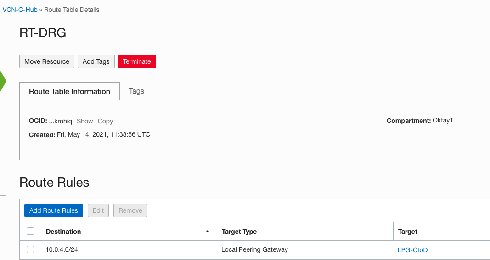

    ```shell
    For RT-LPG:
    Target Type: Dynamic Routing Gateway
	Destination CIDR Block: 10.0.1.0/24
    + Another Route Rule
	Target Type: Dynamic Routing Gateway
	Destination CIDR Block: 10.0.2.0/24
    ```

    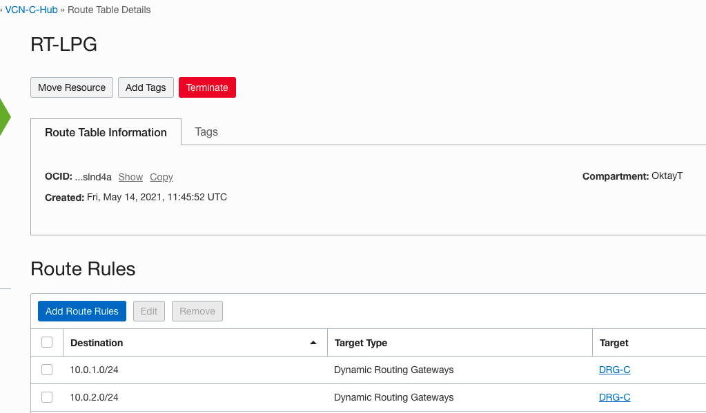

    * In total there should be two rules for RT-LPG and one rule for RT-DRG.

    * Add a route rule to VCN-C-Hub Default Route Table for VCN-C-Hub Spoke

    ```shell
	Target Type: Dynamic Routing Gateway
	Destination CIDR Block: 10.0.2.0/24
    ```
    
    * So a total four rules in the Default Route Table

    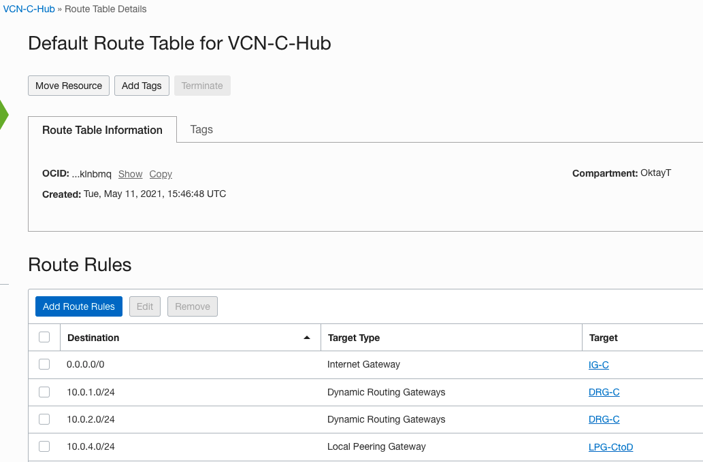


38. Add an Ingress Rule to the VCN-C-Hub Default Security List.

    ```shell
    Source Type: CIDR
    Source CIDR: 10.0.2.0/24
    IP Protocol: All Protocols
    ```

39. Assosiate the route table to the DRG-C on VCN-C-Hub. Go to the "Networking/Virtual Cloud Networks/Virtual Cloud Network Details/Dynamic Routing Gateways" and click "Associate Route Table" from DRG-C vertical ellipsis menu.

    ```shell
    Route Table: RT-DRG
    ```

    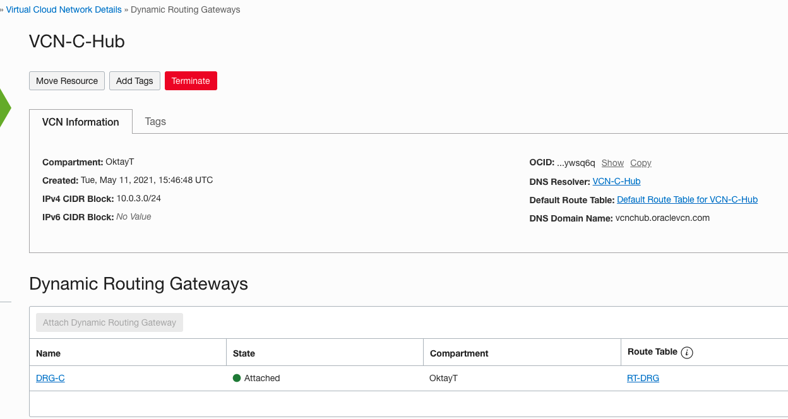

40. Assosiate the route table to the DRG-C on VCN-C-Hub. Go to the "Networking/Virtual Cloud Networks/Virtual Cloud Network Details/Local Peering Gateways" and click "Associate Route Table" from DRG-C vertical ellipsis menu.

    ```shell
    Route Table: RT-LPG
    ```

    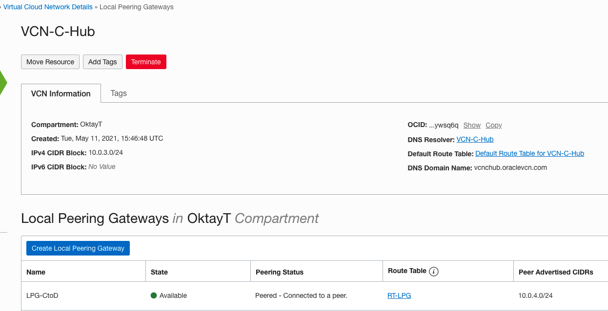

41. Go to the "Networking/Virtual Cloud Networks/VCN-D-Spoke/Route Table Details" and edit the rule from vertical ellipsis menu.


    ```shell
    Old Destination CIDR Block: 10.0.3.0/24
    Destination CIDR Block: 0.0.0.0/0
    ```

    * All the traffic that is coming out from subnet-D (VNC-D-Spoke) is going through the Local Peering Gateway. Since this is a private subnet, we could add two more rules (10.0.1.0/24 and 10.0.2.0/24) without editing. But, we prefer to edit as above without adding any more rules and simplify the step.

    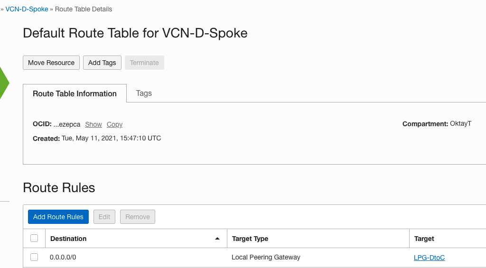

42. Add two Ingress Rules to the VCN-D-Spoke Default Security List.

    ```shell
    Source Type: CIDR
    Source CIDR: 10.0.1.0/24
    IP Protocol: All Protocols
    + Another Ingress Rule
    Source Type: CIDR
    Source CIDR: 10.0.2.0/24
    IP Protocol: All Protocols
    ```

    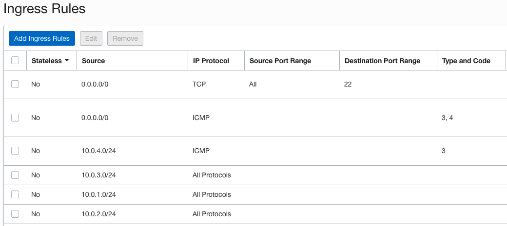

33. All necessary steps have been completed. By testing the connections, we can check this.

    * **Test 1:** Ping test from Instance-a in Frankfurt to Instance-d in Phoenix.

    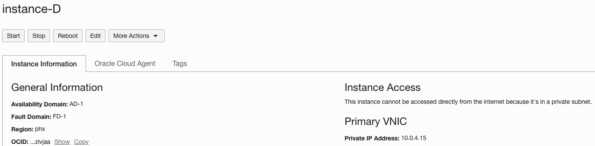

    ```shell
    [opc@instance-a ~]$ ping 10.0.4.15
    PING 10.0.4.15 (10.0.4.15) 56(84) bytes of data.
    64 bytes from 10.0.4.15: icmp_seq=1 ttl=62 time=159 ms
    64 bytes from 10.0.4.15: icmp_seq=2 ttl=62 time=159 ms
    64 bytes from 10.0.4.15: icmp_seq=3 ttl=62 time=159 ms
    ```

    * **Test 2:** Ping test from Instance-b in Frankfurt to Instance-d in Phoenix. 

    ```shell
    [opc@instance-b ~]$ ping 10.0.4.15
    PING 10.0.4.15 (10.0.4.15) 56(84) bytes of data.
    64 bytes from 10.0.4.15: icmp_seq=1 ttl=62 time=163 ms
    64 bytes from 10.0.4.15: icmp_seq=2 ttl=62 time=163 ms
    64 bytes from 10.0.4.15: icmp_seq=3 ttl=62 time=163 ms
    ```

    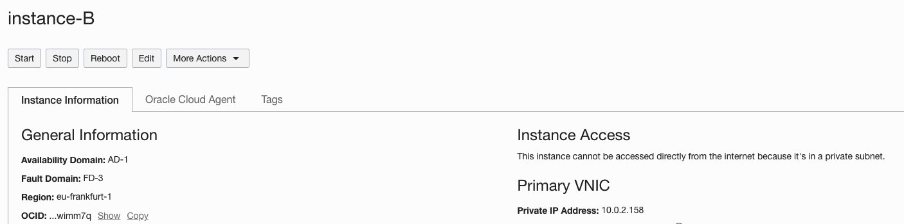

    * **Test 3:** Ping test from Instance-d in Phoenix to Instance-b in Frankfurt. 

    ```shell
    [opc@instance-d ~]$ ping 10.0.2.158
    PING 10.0.2.158 (10.0.2.158) 56(84) bytes of data.
    64 bytes from 10.0.2.158: icmp_seq=1 ttl=62 time=164 ms
    64 bytes from 10.0.2.158: icmp_seq=2 ttl=62 time=163 ms
    64 bytes from 10.0.2.158: icmp_seq=3 ttl=62 time=163 ms
    ```